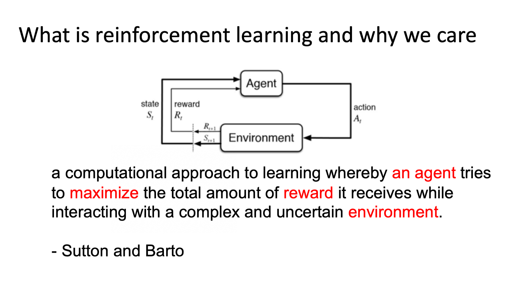

# 第一章 概括与基础

* 强化学习简介
* 序列决策过程
* RL代码实践

<!--## 强化学习简介-->

- **强化学习（Reinforcement Learning）**：Agent可以在与复杂且不确定的Environment进行交互时，尝试使所获得的Reward最大化的计算算法。
- **监督学习（supervised Learning）**：数据符合i.i.d分布、标注数据
- 强化学习数据不符合i.i.d分布，不能立即得到反馈
- 强化学习与监督学习区别：
    * 序列数据输入（不符合i.i.d)
    *